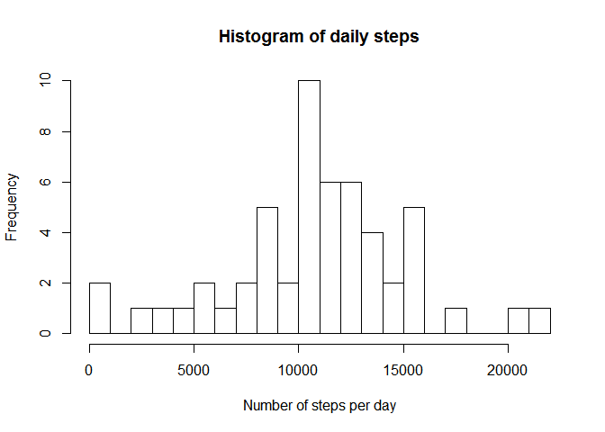
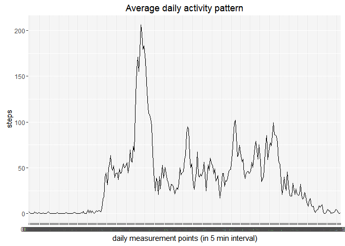
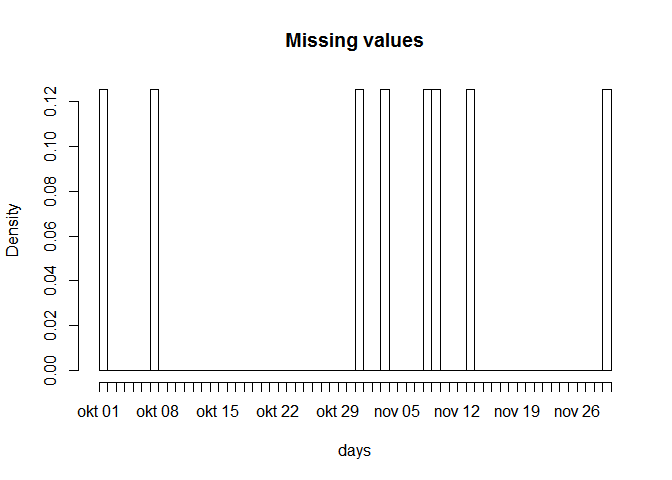
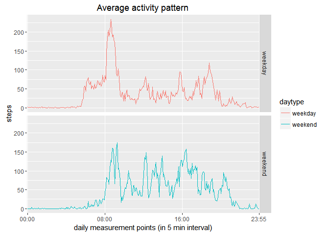

# Reproducible Research: Peer Assessment 1
Sadi46  
18 april 2016  
---

## Loading and preprocessing the data

checking for and creating directory


```r
if (!file.exists("reproducibleData")){
        dir.create("reproducibleData")
}
```
change workdirectory

```r
setwd("reproducibleData") 
```
download and unzip file

```r
temp <- tempfile()
download.file("https://d396qusza40orc.cloudfront.net/repdata%2Fdata%2Factivity.zip",temp, mode="wb") 
unzip(temp, exdir="steps")  
rm(temp)
```

moment of downloading

```r
dateDownloaded<-date()
dateDownloaded
```

```
## [1] "Mon Apr 18 22:52:40 2016"
```

read all data, while converting date to as.Date

```r
data<-read.csv("steps/activity.csv", na.strings="NA", comment.char="", colClasses=c("integer", "Date", "integer"))
```

```r
object.size(data)
```

```
## 282200 bytes
```

convert interval variable  
=> add zeros on the left and a colon(:) in the middle, to make the values readable as timepoints (but class character)

```r
x <- sprintf("%04d", data$interval)
data$time<-sub('..\\K', ':', x, perl=T)

str(data)
```

```
## 'data.frame':	17568 obs. of  4 variables:
##  $ steps   : int  NA NA NA NA NA NA NA NA NA NA ...
##  $ date    : Date, format: "2012-10-01" "2012-10-01" ...
##  $ interval: int  0 5 10 15 20 25 30 35 40 45 ...
##  $ time    : chr  "00:00" "00:05" "00:10" "00:15" ...
```
---

## Total number of steps taken per day

1. Calculate the total number of steps taken per day

```r
dailySteps<- aggregate(steps ~ date, data, sum) 
head(dailySteps)
```

```
##         date steps
## 1 2012-10-02   126
## 2 2012-10-03 11352
## 3 2012-10-04 12116
## 4 2012-10-05 13294
## 5 2012-10-06 15420
## 6 2012-10-07 11015
```

2. Make a histogram of the total number of steps taken each day

```r
hist(dailySteps$steps,
     breaks=20,
     main="Histogram of daily steps",
     xlab="Number of steps per day")
```



## The mean and median of the total steps taken per day

3. Calculate and report the mean and median of the total number of steps taken per day

```r
summary(dailySteps$steps) 
```

```
##    Min. 1st Qu.  Median    Mean 3rd Qu.    Max. 
##      41    8841   10760   10770   13290   21190
```
---

## The average daily activity pattern  

Make a time series plot (i.e. type = "l") of the 5-minute interval (x-axis)   
and the average number of steps taken, averaged across all days (y-axis)

aggregate

```r
intervalSteps <- aggregate(steps ~time , data, mean)
head(intervalSteps)
```

```
##    time     steps
## 1 00:00 1.7169811
## 2 00:05 0.3396226
## 3 00:10 0.1320755
## 4 00:15 0.1509434
## 5 00:20 0.0754717
## 6 00:25 2.0943396
```

create a time series plot

```r
library(ggplot2)
ggplot(data=intervalSteps, aes(x=time, y=steps, group=1)) +
        geom_line() +
        xlab("daily measurement points (in 5 min interval)") +
        ylab("steps") +
        ggtitle("Average daily activity pattern")
```




## Which 5-minute interval, on average across all the days in the dataset, contains the maximum number of steps?  


```r
max<- intervalSteps[which.max(intervalSteps$steps),]
max
```

```
##      time    steps
## 104 08:35 206.1698
```

---

## Strategy for missing values

missing values in the dataset

```r
sum(is.na(data))
```

```
## [1] 2304
```

missing values per variable

```r
colSums(is.na(data))
```

```
##    steps     date interval     time 
##     2304        0        0        0
```

relative missingness

```r
colMeans(is.na(data))
```

```
##     steps      date  interval      time 
## 0.1311475 0.0000000 0.0000000 0.0000000
```

so 13% of the measurements are missing

when?

```r
missing<-data[!complete.cases(data),]
hist(missing$date, "day",
     main="Missing values",
     xlab="days")
```



```r
table(missing$date)
```

```
## 
## 2012-10-01 2012-10-08 2012-11-01 2012-11-04 2012-11-09 2012-11-10 
##        288        288        288        288        288        288 
## 2012-11-14 2012-11-30 
##        288        288
```

--so 8 days are completely missing!--

although the reason for this is unknown, it seems reasonable that these days   
should be excluded from the data, since nothing was measured these days.   
More importantly, replacing 13 % of the data would probably create a fictional dataset!  

make new dataset with complete cases

```r
completeData<-data[complete.cases(data),]
```

checking changes in mean and median

```r
dailySteps2<- aggregate(steps ~ date, completeData, sum)
summary(dailySteps2$steps)
```

```
##    Min. 1st Qu.  Median    Mean 3rd Qu.    Max. 
##      41    8841   10760   10770   13290   21190
```


### Histogram of the total number of steps taken each day after missing values are imputed (in this case erased)


```r
hist(dailySteps2$steps,
     breaks=20,
     main="Histogram of daily steps",
     xlab="Number of steps per day")
```


__since I used aggregate and not tapply, the missing values were already ignored  
and therefore the results are exactly the same.__  


the difference with tapply:

```r
total_steps <- tapply(data$steps, data$date, sum, na.rm=T)
head(total_steps)
```

```
## 2012-10-01 2012-10-02 2012-10-03 2012-10-04 2012-10-05 2012-10-06 
##          0        126      11352      12116      13294      15420
```

```r
mean(total_steps)
```

```
## [1] 9354.23
```

```r
median(total_steps)
```

```
## [1] 10395
```


---

## Differences in activity patterns between weekdays and weekends

1. make new categorical variable for week- or weekenddays

```r
Sys.setlocale("LC_TIME", "English") 
```

```
## [1] "English_United States.1252"
```

```r
completeData$daytype <- weekdays(completeData$date)
completeData$daytype <- ifelse(completeData$daytype %in% c("Saturday", "Sunday"),"weekend", "weekday")
table(completeData$daytype)
```

```
## 
## weekday weekend 
##   11232    4032
```

2. Make a panel plot containing a time series plot (i.e. type = "l") of the 5-minute   
interval (x-axis) and the average number of steps taken, averaged across all weekday days or weekend days (y-axis)

aggregate 

```r
meanSteps <- aggregate(steps ~time + daytype , completeData, mean)
```

create a time series plot

```r
library(ggplot2)
ggplot(data=meanSteps, aes(x=time, y=steps, group=daytype, colour=daytype)) +
        facet_grid(daytype ~ .)+
        geom_line() +
        xlab("daily measurement points (in 5 min interval)") +
        ylab("steps") +
        ggtitle("Average activity pattern") +
        scale_x_discrete(breaks = c("00:00", "08:00", "16:00", "23:55"))
```


---


